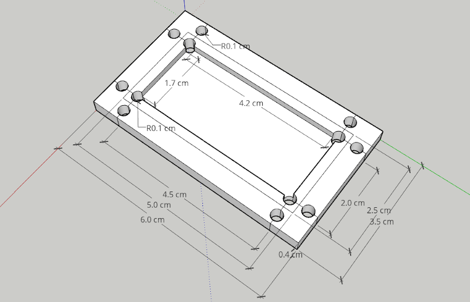

# Shenzhen HiLetgo Technology Co., Ltd Relay Casing with Mount Points

3D Sketchup models for a [HiLetgo Relay module](http://www.hiletgo.com/ProductDetail/1958543.html) case

## Image(s)



## Source Material

1. [Shenzhen HiLetgo Technology Co., Ltd Relay module](http://www.hiletgo.com/ProductDetail/1958543.html) - 3-01-0341-UK-2PCS

## Disclaimers

1. HiLetgo is a brand of [Shenzhen HiLetgo Technology Co., Ltd](http://www.hiletgo.com/Content/350849.html)
2. [Sketchup](https://www.sketchup.com/) is a 3D modeling program owned by [Trimble&reg; Inc.](https://www.trimble.com/)
3. This work is not endorsed, funded, sponsored, or supported by Shenzhen HiLetgo Technology Co., Ltd or Trimble&reg;

## File Description

```txt
HiLetgo-relayCase
├── HiLetgo-relayCase.skp        SketchUp file for model  
├── HiLetgo-relayCase.stl        STL file for model (may be imported to 3D printing software)  
├── HiLetgo-relayCase-500px.png  Isometric image of model  
├── README.md                    This document (a README)
```
